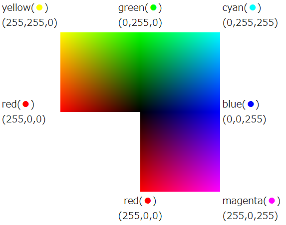
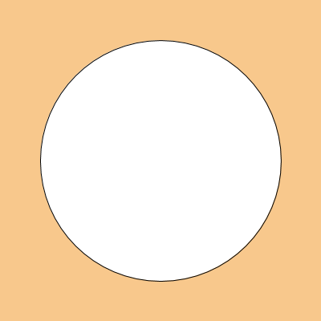
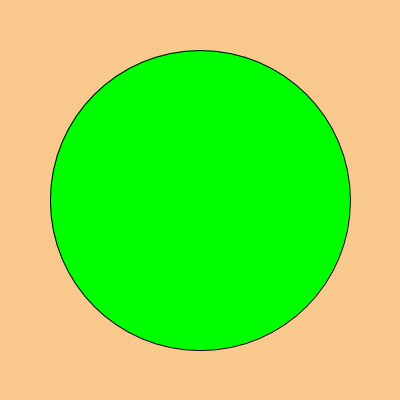
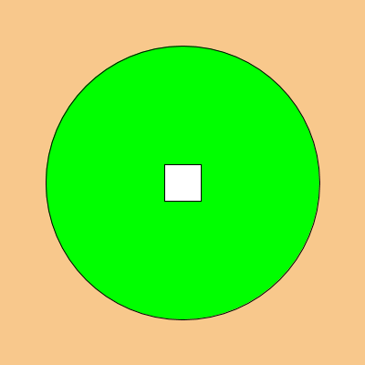

# 色をつける

## カラーコード（RGB）
赤 (Red)、緑 (Green)、青 (Blue)の三つの原色を混ぜて幅広い色を再現。

色の明度は0～255までの256個の数字で表現。


（出典：wikipedia）

---
_コラム_
### Processingの「色選択」を使うと便利

ProcessingIDEのメニューバー/ツール/色選択...をクリック。


---

## 背景色

```java
background(r, g, b);

background(g);
```

- r：赤（0～255）
- g：緑（0～255）
- b：青（0～255）

- g：グレースケール。黒～白の明度を指定（0～255）。

### サンプル

```java
size(400, 400);
background(248, 200, 140);    // 背景色
ellipse(200, 200, 300, 300);  // 円
```



## 図形の色

図形の色を変えたいときは、`fill`関数（命令）を使う。
一度、使うと次に指定するまで効果が持続する。

```java
fill(r, g, b);

fill(g);
```

- r：赤（0～255）
- g：緑（0～255）
- b：青（0～255）

- g：グレースケール。黒～白の明度を指定（0～255）。

### サンプル

```java
size(400, 400);
background(248, 200, 140);    // 背景色
fill(0, 255, 0);              // 図形の色
ellipse(200, 200, 300, 300);  // 円
```



---

```java
size(400, 400);
background(248, 200, 140);    // 背景色
fill(0, 255, 0);              // 図形の色
ellipse(200, 200, 300, 300);  // 円
fill(255);                    // 図形の色
rect(180, 180, 40, 40);       // 四角
```


