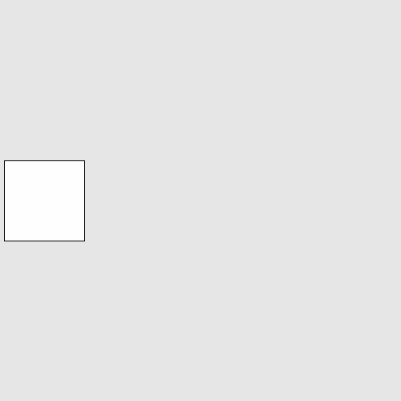
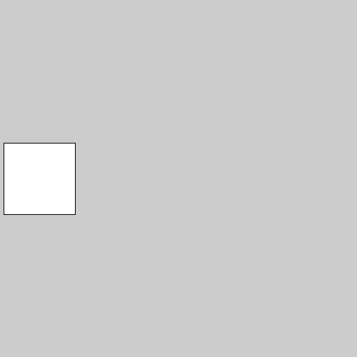
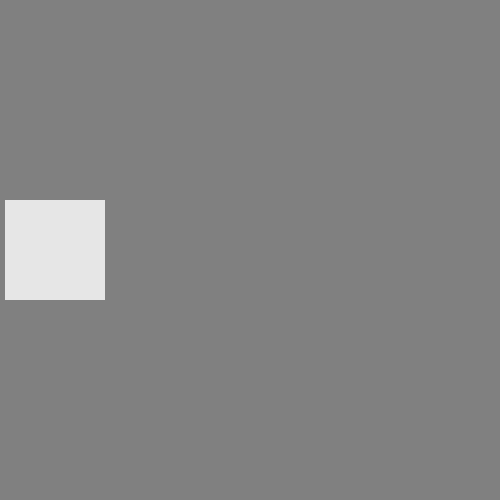

# 図形を動かしたい！

Chapter01では、processingを使って図形を描画した。
しかし、全部止まったままで面白くない。
そこで、まずは図形を動かす方法から学んでいこう。

# void draw() { ... }

結論から言うと、以下のような書き方がある。
詳しくは次節で説明するので、今の時点ではおまじないだと思ってほしい。

```java
void setup() {
    // プログラムの開始時に一度実行される
    size(500, 500);
}

void draw() {
    // この部分が1秒に60回実行される
}
```

`void setup() { ... }`の`{}`で囲まれた部分はプログラムの開始時に一度だけ実行される。
この中には、`size`関数[^?]などの一度しか呼ばない命令を書く。

`void draw() { ... }`の`{}`で囲まれた部分は1秒におよそ60回繰り返して呼ばれる。

[^?]: 関数：命令をまとめて呼び出せるようにしたもの。今まで使っていた`size`, `rect`, `ellipse`はすべて関数。詳しくは次節。

# Q.この時点で図形の動かし方、ひらめきます？

ヒント：
1. アニメーションはパラパラ漫画のようなもの
1. つまり、少しずつ座標を変えて表示すれば・・・
1. ちょうど1秒間に60回繰り返してくれる仕組みが・・・
1. 直接座標を書いたら変更できないけど、変数を少しずつ増やせば・・・

# A.変数を使えば図形を動かすことができる

先ほど紹介した通り、`void draw() { ... }`の`{}`で囲まれた部分は1秒におよそ60回繰り返して呼ばれるのだが、

1. `void draw() { ... }`の外で宣言した変数を
2. `void draw() { ... }`の中で変化させる

ことで図形を動かすことができる。

文字だけだと分かりづらいので、プログラムで解説する。

```java
float position = 0;

void setup(){
    size(500,500);
}

void draw(){
    background(230);

    //positionという変数の値を5ずつ増やす
    position = position + 5;

    //positionを使って四角を描画
    rect(position,200,100,100);
}
```

実行するとこんなふうになる



ここで、`background()`で画面を塗りつぶさなかった場合、こんなふうになる



さらに、`background()`の代わりに半透明の四角で画面を塗りつぶすと、残像のようなものができる



このように、Processingでは色々な表現ができるので、`rect()`以外にも`ellipse()`や`triangle()`などの関数を使っていろいろな動きを試してみてほしい。