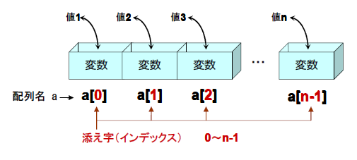

# 配列って何?
配列は同じ型の複数のデータを扱うためのもので、とても重要。
>
<br>https://talavax.com/array.html より

## 宣言してみる
宣言は、
```java
[配列の型][] [配列の名前]=new [配列の型][[要素数]];
```
または
```java
[配列の型][] [配列の名前]={[配列の要素]}//要素はそれぞれを","で区切る
```
というようになる。
<br>例として、int(整数)型の配列を宣言する。
```java
int[] intArray=new int[100];//100個の要素を持つ配列を作成

int[] intArray2={10,30,54,42,63};//10,30,54,42,63を要素に持つ配列を作成
```

## 配列の使い方
配列は、
```java
[配列の名前][[インデックス]]//インデックスは[0]~[要素数-1]の間の整数
```
で要素を取り出す。
<br>以下例
```java
println(intArray2[3]);//42 intArrayの4番目の要素を取り出している
```
変数のように代入することもできる。
<br>以下例
```java
intArray[1]=100
println(intArray);//{10,100,54,42,63}となる
```
次節の繰り返しを使えるようになると配列は本領を発揮する。

## 補足
配列の長さは、
```java
[配列名].length
```
で取得することができる。