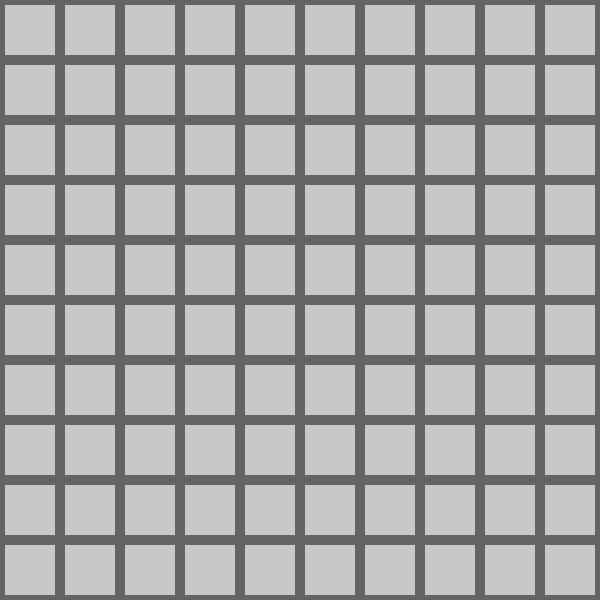

<link href="../css/original.css" rel="stylesheet">

# 繰り返し処理をする
配列を扱う上で、繰り返し処理をする構文は必ず使うことになる。

## 1.while文
while文は、

```java
while([条件式]){
  //繰り返す処理
}
```
というように記述する。
<br>条件式があることから分かると思うが、while文は英語でいう 「~の間中」という意味と同じように、条件式を満たすあいだ括弧内の処理を繰り返す。
<br>以下例

```java
while(true){
  println("loop");
}//loopとプログラムを止めるまで表示される

int i=0;
while(i<10){
  println(i);
  i++;//iに1ずつ加算する(i=i+1と同じ)
}//0 1 2 3 4 5 6 7 8 9と表示される
```

## 2.for文
for文は、決まった回数繰り返す処理を記述するときに使われる。
<br>なので、先ほどのwhile文の2個目の例をより簡潔に書くことができる。
<br>書き方は、

```java
for([初期化式];[条件式];[変化式]){
  //繰り返す内容
}
```

となる。
<br>解説すると、初期化式というのはwhile文の2個目の例での`int i=0;`に当たる。
<br>条件式というのは、while文と同じく処理を繰り返す条件のことであり、変化式というのは括弧内の処理が実行し終わるたびに呼ばれるもので、while文の2個目の例での`i++;`に当たる。
<br>以下例

```java
for(int i=0;i<10;i++){
  println(i);
}//0 1 2 3 4 5 6 7 8 9と表示される
```

このように、より簡潔に定数回の繰り返しを記述することができる。

## for文と配列
勘の良い人はもう気付いているかもしれないが、for文の条件式に配列の長さ分ループするような条件を書くことによって配列を効率的に処理することができる。
<br>例として、配列のすべての要素を2倍する。

```java
int[] array={10,20,30,40,50};

for(int i=0;i<array.length;i++){
  array[i]=array[i]*2;//2倍して代入
}

println(array);//{20,40,60,80,100}
```

## 練習1
for文は実際に触ってみないと分かりづらいと思うので、以下のソースコードの`//<your program>`の部分にfor文を使って四角形を横に10個並べる処理を書いてみてほしい。

```java
void setup(){
  size(600,600);
}

void draw(){
  background(100);
  fill(200);
  noStroke();

  //<your program>

}
```
成功例:
<br>

<details>
  <summary>ヒント</summary>

  <li>初期化式の部分で初期化した変数を`rect()`関数のx座標の部分に60を掛けて入れてみると...?

</details>
<br>
<details>
  <summary>答え</summary>
  <pre>
<code>
void setup(){
  size(600,600);
}

void draw(){
  background(100);
  fill(200);
  noStroke();

  for(int i=0;i<10;i++){
    rect(5+i*60,275,50,50);
  }

}</code>
  </pre>

</details>

## 練習2
for文もある程度分かってきたと思うので、次はfor文を2重にして使ってみてほしい。
<br>先ほどと同じように`//<your program>`の部分にfor文を使って四角形を縦横10×10並べる処理を書いてほしい。

```java
void setup(){
  size(600,600);
}

void draw(){
  background(100);
  fill(200);
  noStroke();

  //<your program>

}
```
成功例:
<br>

<details>
  <summary>ヒント</summary>

  <ol>
    <li>for文の中にfor文を入れると外側にある変数と同じ名前の変数は使えなくなるので名前を変えてみよう
    <li>今度はy座標の部分に内側のfor文で宣言した変数を使うようにすると...?
  </ol>

</details>
<br>
<details>
  <summary>答え</summary>
  <pre>
<code>
void setup(){
  size(600,600);
}

void draw(){
  background(100);
  fill(200);
  noStroke();

  for(int i=0;i<10;i++){
    for(int j=0;j<10;j++){
      rect(5+i*60,5+j*60,50,50);
    }
  }

}</code>
  </pre>
</details>