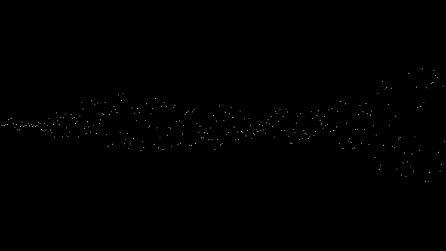
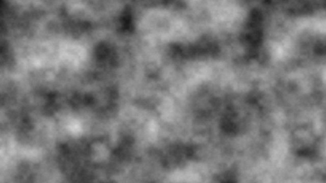

# ランダムを扱う
この節では、ゲームによく出てくるランダムについて学ぶ。

## そもそもランダムとは
>事象の発生に法則性（規則性）がなく、予測が不可能な状態 -Wikipediaより

Processingでは、引用にあるように予測が不可能[^2]な小数を生成することができる機能がある。

## 使い方
使い方は、`random()`関数を使う。
```java
random([最大値]);//0~最大値の範囲で生成

random([最小値],[最大値]);//最小値~最大値の範囲で生成
```
↓ランダムを使用した例
<br>
## ノイズ[^1]
Processingには、ランダム以外にも`noise()`という、`random()`で生成するよりも連続的な変化をする数値を出力するものがある。
```java
noise([x座標]);//1次元ノイズ

noise([x座標],[y座標]);//2次元ノイズ

noise([x座標],[y座標],[z座標]);//3次元ノイズ
```
↓2次元ノイズの画像
<br>

---
[^1]: ノイズの中でも2次元ノイズは、Minecraftなどのゲームの地形の生成に使用されている。
[^2]: 実際は、乱数生成器というプログラムを利用しているため、プログラミングで使うランダムな値には周期性がある。ただ、周期があるとはいえ非常に長い周期なので、暗号を使いたいのでなければ気にする必要はない。