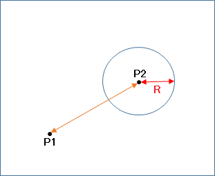

<link href="../css/original.css" rel="stylesheet">
<link rel="stylesheet" href="https://cdnjs.cloudflare.com/ajax/libs/highlight.js/11.9.0/styles/default.min.css">

# マウスを使った作品を作る
前の節でProcessingにおけるマウスの使い方を紹介したので、今回は実際に作品を作ってみよう。

## 今回作るゲーム
今回は、某エイム力を鍛えるゲームのように
1. ランダムな場所に的が出現
2. 的をクリックすると、的はランダムな場所に移動する

というロジックのゲームを作る。

## 必要な変数
基本的には、今回は的の位置(x,y)を表す2つの変数だけで十分だろう。 
型はintとfloatどちらでも実装できる。

## ランダムな場所に出現させる
この処理は、前章で学んだrandom()を使って的の位置を変更すれば実現できる。

的をクリックするごとに呼び出されるので、関数にすると楽だろう。

## 本当に的をクリックした?
おそらく今回で一番難しい部分が、的とマウスが接触したかの判定だ。 
というのも、単純にマウスと的のx座標、y座標を比較するだけでは正しく判定できないからだ。

>
>
>引用元:[gameworkslab.jp-点と球の当たり判定](https://gameworkslab.jp/2018/11/29/%E7%82%B9%E3%81%A8%E7%90%83%E3%81%AE%E5%BD%93%E3%81%9F%E3%82%8A%E5%88%A4%E5%AE%9A/)

ただ、そもそも円というのは「中心からの距離が半径以下の点の集まり」であるため、中心からの距離が「半径以下」か「半径より大きい」かで接触の判定ができる。 
肝心の円の中心とマウスの距離の求め方については、`dist([x1],[y1],[x2],[y2])`という関数で計算することができる。

判定するタイミングは、「マウスが押されたとき」が良いだろう。

  
判定式の例

  <pre>
<code class="lang-java">
dist([的のx座標],[的のy座標],mouseX,mouseY)<=[半径]</code>
  </pre>

## 解答例

  
全体のコード

  <pre>
<code class="lang-java">
float circle_x;//的のx座標
float circle_y;//的のy座標
float circle_size=20;//的の直径

void setup(){
  size(960,540);
  set_circle_position();//的の初期位置を設定
}

void draw(){
  background(30);
  fill(200,50);
  stroke(200);
  circle(circle_x,circle_y,circle_size);//的を描画
  textAlign(CENTER);
  textSize(13);
  fill(200);
  if(circle_y>height*0.5){//文字で装飾してみる
    text("Click here!",circle_x,circle_y-circle_size);
  }else{
    text("Click here!",circle_x,circle_y+circle_size*1.3);
  }
}

void mousePressed(){
  if(dist(circle_x,circle_y,mouseX,mouseY)<=circle_size*0.5)set_circle_position();//半径を使ってクリックを判定
}

void set_circle_position(){//ウィンドウの端に埋もれない範囲からランダムな位置を選ぶ
  circle_x=random(circle_size*0.5,width-circle_size*0.5);
  circle_y=random(circle_size*0.5,height-circle_size*0.5);
}</code>
  </pre>

