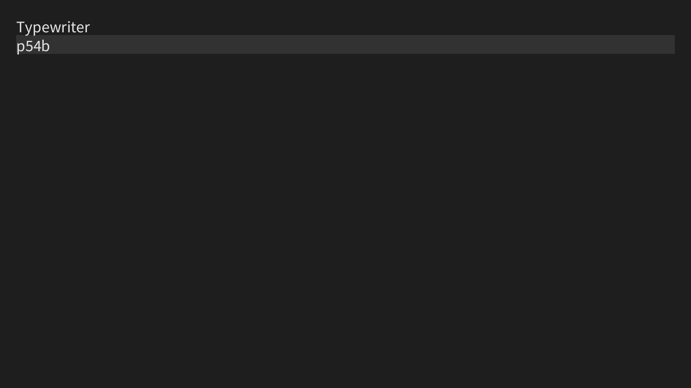

<link href="../css/original.css" rel="stylesheet">
<link rel="stylesheet" href="https://cdnjs.cloudflare.com/ajax/libs/highlight.js/11.9.0/styles/default.min.css">
<script src="https://cdnjs.cloudflare.com/ajax/libs/highlight.js/11.9.0/highlight.min.js"></script>

# タイプライター
キーボードを使った作品を作ってみよう。

## 作るもの
今回は、キーを打ち込んで文章を書くことができるプログラムを作ってみよう。



## 文字列、どう管理する?
キーボードを入力すると、表示される文字列のデータに押したキーが追加されるようにしたい。<br>
ここで、`String`型の変数と`key`変数の足し算をすることで文字列を結合することができる。
```Java
String text="";//文章を管理する変数

//いろんな処理

void mousePressed(){
  text=text+key;//文字列と文字を足して結合。
}
```

画面に表示するときは、上のサンプルでいう`text`変数を`text();`関数の中に入れればいい。<br>
これをベースに仕組みを考えてみよう。

## 文字の確認
ただ単に文字列を結合するだけだと、ShiftキーやCtrlキーなどを押したときに不可解なものが入力されてしまう。<br>
なので、[前の節](../key.html)で解説した文字の判定を使ってみよう。

## 改行したい!
文字であることを判定できるようになったは良いものの、このままではEnterキーで改行することができない。<br>
そこで、`KeyCode`を使った判定を使う。

具体的には、こんなふうになる。
```Java
if(keyCode == ENTER){//Enterが押された
  //処理
}
```

また、プログラムにおいて改行は`\n`という特殊な文字で表されるので、文章を保存している文字列に`\n`を足せば改行できるようになるはずだ。

## 解答例
<details class="accordion">
  <summary>今回のプログラム</summary>
  <pre>
<code class="lang-java">
String input;//入力された文字列
int line=0;//現在の改行数

float text_size=30;//テキストの大きさ
float text_leading=35;//行の高さ
float margin=30;//ウィンドウと描画位置の間の幅

void setup(){
  size(1280,720);
  input="";//初期化
  textSize(text_size);//テキストの大きさを変更
  textLeading(text_leading);//行の高さを変更
}

void draw(){
  background(30);
  fill(50);
  noStroke();
  rect(margin,margin+text_leading*line,width-margin*2,text_leading);//現在の行をハイライト
  fill(230);
  text(input,margin,margin+text_size);//テキストを表示
}

void keyPressed(){
  if(key!=CODED&&keyCode!=DELETE&&keyCode!=BACKSPACE){//キーが文字でない、またはDeleteかBackspaceの場合は処理をスキップ
    input+=key;//押されたキーの文字を連結
  }
  if(keyCode==ENTER){//Enterが押されたら改行数を更新
    line++;
  }
}</code>
  </pre>
</details>

## 発展:削除や入力位置の変更を出来るようにする
※時間があったらやってみよう

前回紹介したStringBuilderを駆使することで、削除や入力位置の変更に対応させることができる。<br>
いきなりすべて実装するのは難しいので、
1. `String input`を`StringBuilder input`に変更
2. `Backspace`による削除に対応
3. 入力位置を変更できるようにする
4. `Delete`による削除に対応

の順番で実装するのが良いだろう。

<details class="accordion">
  <summary>発展版の解答例</summary>
  <pre>
<code class="lang-java">
StringBuilder input;
int caret_position=0;

float text_size=30;
float text_leading=35;
float margin=30;

void setup(){
  size(1280,720);
  input=new StringBuilder(&quot;&quot;);
  fill(230);
  stroke(230);
  textSize(text_size);
  textLeading(text_leading);
}

void draw(){
  background(30);
  String input_text=input.toString();
  text(input_text,margin,margin+text_size);
  String sub_text=input_text.substring(0,caret_position);
  float h=count(sub_text,&quot;\n&quot;)*text_leading;
  float w=0;
  if(!sub_text.endsWith(&quot;\n&quot;)){
    String[] lines=sub_text.split(&quot;\n&quot;);
    w=textWidth(lines[lines.length-1]);
  }
  line(margin+w,margin+h,margin+w,margin+h+text_size);
}

int count(String string,String target){
  int c=0;
  int i=0;
  int len=target.length();
  while ((i=string.indexOf(target,i))!=-1){
    c++;
    i+=len;
  }
  return c;
}

void keyPressed(){
  if(keyCode==BACKSPACE){
    if(caret_position&gt;0){
      input.deleteCharAt(caret_position-1);
      caret_position--;
    }
  }else if(keyCode==DELETE){
    if(caret_position&lt;input.length()){
      input.deleteCharAt(caret_position);
    }
  }else if(keyCode==LEFT){
    if(caret_position&gt;0)caret_position--;
  }else if(keyCode==RIGHT){
    if(caret_position&lt;input.length())caret_position++;
  }else if(key!=CODED){
    input.insert(caret_position,key);
    caret_position++;
  }
}</code>
  </pre>
</details>